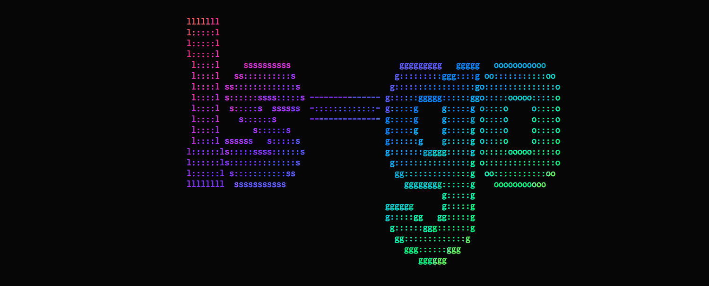

A more colorful, user-friendly implementation of `ls` written in [Go](https://golang.org/).

You want to be able to glean a lot of information as quickly as possible from `ls`.
Colors can help, your mind parse the information.
You can configure `ls` to color the output a little bit.
Configuring `ls` is a hassle though, and the colors are limited.

Instead, you can use `ls-go`.
It is highly colored by default.
It has much fewer flags so you can get the behavior you want more easily.
The colors are beautiful and semantic.
A terminal with xterm-256 colors is **required*.*


## Install

```sh
$ go get github.com/acarl005/ls-go
```

## Usage


Of course, you can use an alias to save some typing and get your favorite options.


```
usage: ls-go [<flags>] [<paths>...]

Flags:
  -h, --help       Show context-sensitive help (also try --help-long and --help-man).
  -a, --all        show hidden files
  -b, --bytes      include size
  -m, --mdate      include modification date
  -o, --owner      include owner and group
  -p, --perms      include permissions for owner, group, and other
  -l, --long       include size, date, owner, and permissions
  -d, --dirs       only show directories
  -f, --files      only show files
  -L, --links      show paths for symlinks
  -R, --link-rel   show symlinks as relative paths if shorter than absolute path
  -s, --size       sort items by size
  -t, --time       sort items by time
  -k, --kind       sort items by extension
  -S, --stats      show statistics
  -i, --icons      show folder icon before dirs
  -r, --recurse    traverse all dirs recursively
  -F, --find=FIND  filter items with a regexp

Args:
  [<paths>]  the files(s) and/or folder(s) to display
```

### Prior Art

This is inspired by [monsterkodi/color-ls](https://github.com/monsterkodi/color-ls), ported to Go, with various modifications.

